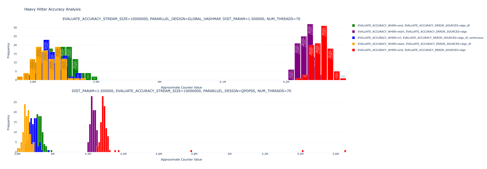

# Experimental Setup

This document details the experimental setup used for evaluating Cuckoo Heavy Keeper and its parallel variants.

## Hardware Platforms

We conducted experiments on two hardware platforms:

| Specification | Platform A | Platform B |
|---------------|------------|------------|
| Processor | Intel(R) Xeon(R) E5-2695 v4 (dual socket) | AMD EPYC 9754 (single socket) |
| Cores/Clock | 36 cores/2.1 GHz | 128 cores/2.25 GHz |
| Hyper Threading | Enabled | Disabled |
| Cache (L1/L2/L3) | 32KB/256KB/45MB | 32KB/1024KB/256MB |
| Used for | All experiments | Parallel experiments only |

## Datasets

We used three datasets in our evaluation:

1. **CAIDA_L**: A real-world dataset of source IPs with relatively low skew (skewness ~1.2)
2. **CAIDA_H**: A real-world dataset of source ports with high skew (skewness ~1.5)
   - Both CAIDA datasets were derived from the CAIDA Anonymized Internet Traces 2018, extracting source IPs and source ports from the first 10M packets
3. **Synthetic Data**: 10M elements generated using Zipfian distributions with skewness α ranging from 0.8 to 1.6

## Compared Algorithms

We compared Cuckoo Heavy Keeper (CHK) with the following state-of-the-art algorithms:

- **Space-Saving (SS)**
- **Count-MinSketch (CMS)**
- **Augmented-Sketch (AS)**
- **HeavyKeeper (HK)**

All algorithms were implemented in C++, compiled with -O2 optimization, and use auxiliary heaps for continuous heavy hitter tracking.

## Evaluation Metrics

We evaluated the algorithms using four key metrics:

1. **Precision**: Ratio of true heavy hitters among all reported heavy hitters
2. **Recall**: Ratio of reported true heavy hitters to actual true heavy hitters
3. **ARE (Average Relative Error)**: Average relative error in frequency estimation
4. **Throughput**: Number of operations processed per second

## Parameter Settings

Default values for experiments:
- Threshold φ: 0.0005
- Memory usage: 4KB
- Skewness α: 1.2 (for synthetic data)

For each experiment, we varied one parameter while keeping the others at their default values:
- For synthetic data: threshold φ, memory usage, and skewness α
- For real-world CAIDA datasets: threshold φ and memory usage

## Parallel Algorithm Variants

For parallel experiments, we evaluated:

1. **Insertion-optimized variants (-I)**:
   - mCHKI (Cuckoo Heavy Keeper)
   - mAS-I (Augmented Sketch)
   - mCMS-I (Count-Min Sketch) 
   - mSS-I (Space-Saving)

2. **Query-optimized variants (-Q)**:
   - mCHKQ (Cuckoo Heavy Keeper)
   - mAS-Q (Augmented Sketch)
   - mCMS-Q (Count-Min Sketch)
   - mSS-Q (Space-Saving)

Default settings for parallel experiments:
- φ: 0.00005
- Memory: 1KB per thread
- MAX_W: 1000
- MAX_BUF: 16

## Experimental Methodology

- Each experiment was run 30 times
- Results show average performance and standard deviation
- For parallel experiments, we measured:
  - Insertion throughput under varying thread counts and heavy hitter query rates
  - Heavy hitter query latency under varying thread counts and query rates

## Experimental Results

The detailed experimental results are presented in the following figures:

### Sequential Evaluation Results

#### Synthetic Data (Zipfian Distribution)
[View PDF](sequential_zipf.pdf)

<object data="sequential_zipf.pdf" type="application/pdf" width="100%" height="500px">
  
Your browser does not support PDF embedding. You can <a href="sequential_zipf.pdf">download the PDF</a> instead.

</object>

#### CAIDA_H (High Skew Dataset)
[View PDF](sequential_CAIDA_H.pdf)

<object data="sequential_CAIDA_H.pdf" type="application/pdf" width="100%" height="500px">
  
Your browser does not support PDF embedding. You can <a href="sequential_CAIDA_H.pdf">download the PDF</a> instead.

</object>

#### CAIDA_L (Low Skew Dataset)
[View PDF](sequential_CAIDA_L.pdf)

<object data="sequential_CAIDA_L.pdf" type="application/pdf" width="100%" height="500px">
  
Your browser does not support PDF embedding. You can <a href="sequential_CAIDA_L.pdf">download the PDF</a> instead.

</object>

### Parallel Evaluation Results

#### Throughput Comparison
[View PDF](par_throughput_CAIDA_H_comparison.pdf)

<object data="par_throughput_CAIDA_H_comparison.pdf" type="application/pdf" width="100%" height="500px">
  
Your browser does not support PDF embedding. You can <a href="par_throughput_CAIDA_H_comparison.pdf">download the PDF</a> instead.

</object>

#### Latency Comparison
[View PDF](par_latency_CAIDA_H_comparison.pdf)

<object data="par_latency_CAIDA_H_comparison.pdf" type="application/pdf" width="100%" height="500px">
  
Your browser does not support PDF embedding. You can <a href="par_latency_CAIDA_H_comparison.pdf">download the PDF</a> instead.

</object>

### Additional Validation Results

#### Concurrent Query Accuracy Validation
[View Image](CHK_accuracy.png)

This figure demonstrates the accuracy of concurrent heavy hitter queries (hh-queries) to validate Theorem 6.1 in our paper. Due to space constraints and the technical complexity involved, this analysis was not included in the final paper.

The experiment measures the accuracy distribution during concurrent queries and compares the observed distributions with theoretical predictions. Since we cannot determine the absolute "correct" results in a concurrent setting (due to the very nature of concurrency), we analyze the distribution of the query results.

The results show that the accuracy distribution of hh-queries precisely follows the theoretical bounds established in Theorem 6.1, confirming that our parallel algorithm designs maintain predictable accuracy guarantees even under high concurrency. This provides empirical validation for our theoretical analysis of concurrent heavy hitter detection.